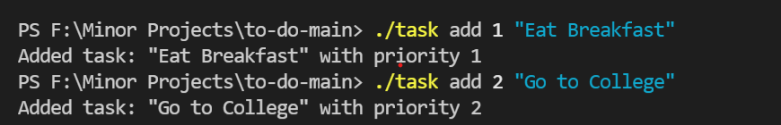
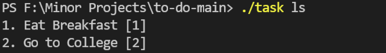
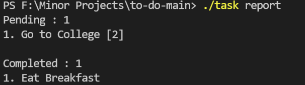
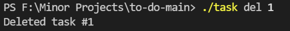

# To Do - Priority list | CLI Program

## Getting started

1. You will need to have node installed in your system. If you don't have Node.js you can install it from [here](https://nodejs.org/en/).

2. [Clone this Git Repository](https://docs.github.com/en/repositories/creating-and-managing-repositories/cloning-a-repository) and move to desired directory.

3. Once you are done with the above step you should be able to execute the task app by running the following command from the terminal.


   **On Windows:**

   ```
   .\task.bat
   ```

   **On Linix:**

   ```
   ./task.sh
   ```
PendingList will have all those tasks that are yet to complete sorted in ascending order of priority while the CompletedList will contain the tasks,again sorted wrt priority  which have been completed.
*Note: smaller number signify high priority*
## Usage

### 1. Help

Executing the command without any arguments, or with a single argument help prints the CLI usage.It will provide you an idea about what commands you can execute.

```
$ ./task help
Usage :-
$ ./task add 2 hello world    # Add a new item with priority 2 and text "hello world" to the list
$ ./task ls                   # Show incomplete priority list items sorted by priority in ascending order
$ ./task del INDEX            # Delete the incomplete item with the given index
$ ./task done INDEX           # Mark the incomplete item with the given index as complete
$ ./task help                 # Show usage
$ ./task report               # Statistics
```


### 2. Add a new task

You can use the add command. *The text of the task should be enclosed within double quotes.*After execution the tasks will be added in PendingList.

```
$ ./task add 5 "clean floors"
Added task: "clean floors" with priority 5
```

### 3. List all pending tasks

You can use the ls command to see all the tasks that are not yet complete, in ascending order of priority in below format.

```
[Serial number] [task] [priority]
```

Example:

```
$ ./task ls
1. clean floors [2]
2. clean study room [5]
```


### 4. Mark a task as completed

You can use the done command to mark an task as completed by its index.The specified task will move from PendingList to CompletedList.

```
$ ./task done 1
Marked item as done.
```

### 5. Generate a report

Show the number of complete and incomplete tasks in the list. and the complete and incomplete tasks grouped together.

```
$ ./task report
Pending : 2
1. this is a pending task [1]
2. this is a pending task with priority [4]

Completed : 3
1. completed task
2. another completed task
3. yet another completed task
```

### 6. Delete a task

You can use the del command to remove an task by its SL No from Pending List.

```
$ ./task del 3
Deleted item with serial number 3
```
